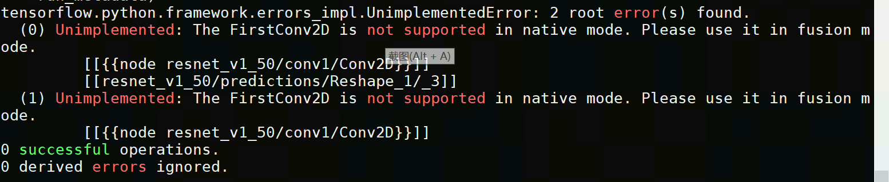

# 踩坑记录

#### 原始链接

https://developer.cambricon.com/index/curriculum/expdetails/id/11/classid/8.html

#### 适配环境

软件：sdk1.7.0+python3.7.8+tensorflow1.15.4

硬件：寒武纪MLU270-X5K加速卡

#### 踩坑过程

##### 1.mlu在线逐层报错



原因：逐层调用cnnl，不支持firstconv

##### 2.编译报错，缺少opencv库

原因：docker里面没有opencv c++库，需要自行安装，装好后需修改Makefile, 指定opencv4头文件和lib库路径 

opencv4安装办法：https://www.jianshu.com/p/f54b0fc13811

##### 3.opencv装好之后，运行报opencv相关错

```
main.cpp添加头文件：
#include <opencv2/imgproc/types_c.h>
```

##### 4.离线模型top5识别结果不对，且出现coredump

现象：cambricon tensorflow生成离线模型时，firstconv信息没有包含进来，本来应该输入是uint8类型，输出fp16类型，现在输入输出都是fp32类型

解决办法：

1）设置firstconv在cpu上补齐：export TF_MLU_ADD_STRIDE=1

2）修改main.cpp line293: outputSizeS[output_idx]/2 -> outputSizeS[output_idx]/4
